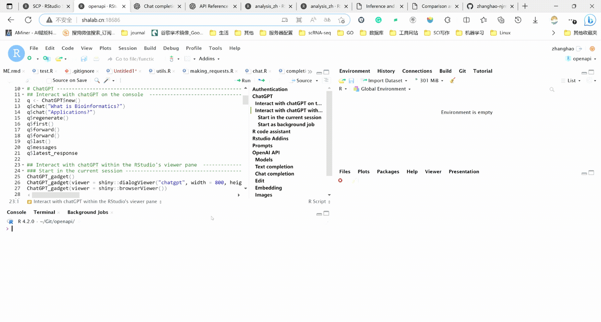
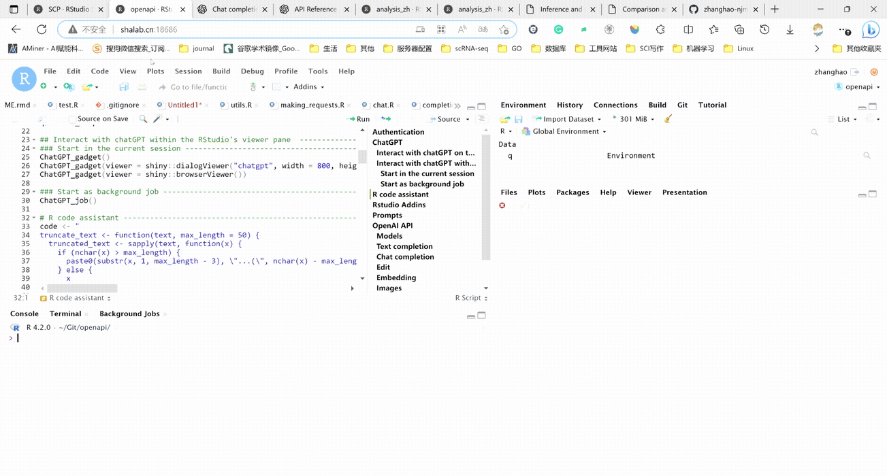
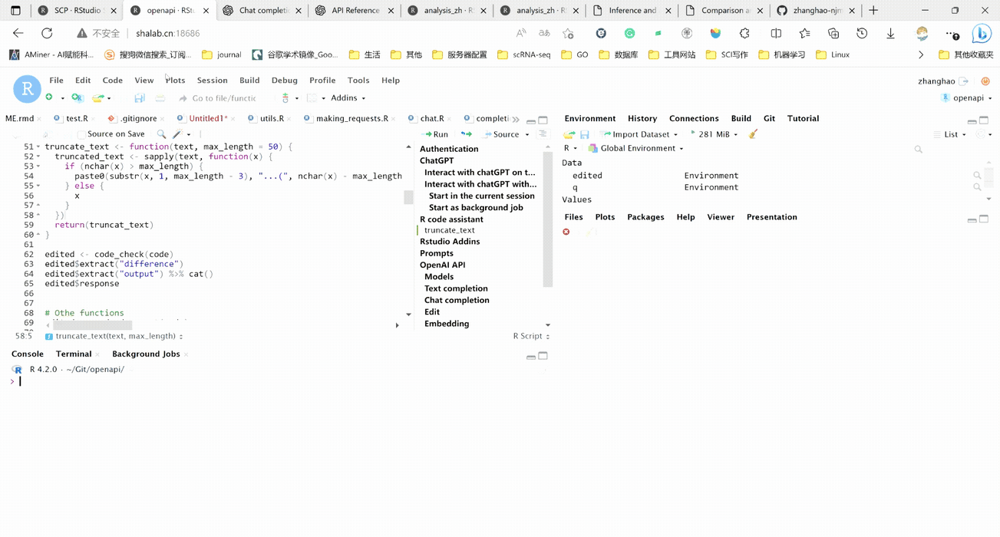

# openapi (<u>Open</u>AI <u>API</u>)

<!-- badges: start -->

[](https://github.com/zhanghao-njmu/openapi)
[](https://github.com/zhanghao-njmu/openapi)

<!-- badges: end -->

**openapi** is an R interface used to connect with the [OpenAI
API](https://platform.openai.com/docs/api-reference). It enables R users
to call all API methods in the R environment and provides
[R6Class](https://r6.r-lib.org/) for various API returns.

With R6Class, it’s easy to extract and process the return information,
and also beneficial for other R method development.

openapi also offers ChatGPT application in the R environment, which can
be run in the console, Rstudio viewer, browser, or background, to assist
R users in improving their work efficiency.

With openapi, various assistant can be created to help R users in
different tasks such as code writing.

Additionally, these applications are created as Rstudio add-ins, making
it convenient for R users to upload and handle their own code in
ChatGPT.

## Installation

``` r
if (!require("devtools", quietly = TRUE)) {
  install.packages("devtools")
}
devtools::install_github("zhanghao-njmu/openapi")
```

# Authentication

To use openapi, the `api_URL` and `api_key` must be provided.

The `api_key` needs to be generated through one’s own OpenAI account.
The default `api_url` is
[https://api.openai.com](https://api.openai.com/), but it can also be
set to other OpenAI API [reverse proxy
addresses](https://github.com/imyuanx/chatgpt-proxy).

With `api_setup` function, one can manually set the `api_url` and
`api_key`, and then all functions in openapi do not need to specify
these two parameters.

One can also modify .Rprofile manually, for example, by setting
`options(openapi_api_key = api_key)` to specify `api_key` permanently.

``` r
library(openapi)

## Official OpenAI API
api_url <- "https://api.openai.com"
api_key <- "Bearer sk-xxxxxxxxxxxxxxxxxxxxxxxxxxxxxxxxxxxxxxxxxxxxxxxx"
api_setup(api_url = api_url, api_key = api_key, key_nm = "Authorization")

## Azure OpenAI API
api_url <- "https://xxxxxx.openai.azure.com"
api_key <- "xxxxxxxxxxxxxxxxxxxxxxxxxxxxxxxx"
api_setup(api_url = api_url, api_key = api_key, key_nm = "api-key")
```

# ChatGPT

## Interact with chatGPT on the console

``` r
q <- ChatGPT$new()
q$chat("What is Bioinformatics?")
q$chat("Application?")
q$regenerate()
q$first()
q$forward()
q$forward()
q$last()
q$messages
q$latest_response
```



If you are using the Azure OpenAI API, you will need to update the
endpoint. For example:

``` r
ChatGPT$new(chat_params = list(endpoint = "openai/deployments/gpt3/chat/completions?api-version=2023-03-15-preview"))
```

Or for `ChatGPT_app` function:

``` r
ChatGPT_app(endpoint = "openai/deployments/gpt3/chat/completions?api-version=2023-03-15-preview")
```

## Interact with chatGPT within the RStudio’s viewer pane

### Start in the current session

``` r
ChatGPT_gadget()
ChatGPT_gadget(viewer = shiny::dialogViewer("chatgpt", width = 800, height = 1000))
ChatGPT_gadget(viewer = shiny::browserViewer())
```


### Start as background job

``` r
ChatGPT_job()
```



# R code assistant

``` r
code <- "
truncate_text <- function(text, max_length = 50) {
  truncated_text <- sapply(text, function(x) {
    if (nchar(x) > max_length) {
      paste0(substr(x, 1, max_length - 3), \"...(\", nchar(x) - max_length, \" characters omitted)\")
    } else {
      x
    }
  })
  return(truncat_text)
}
"
edited <- code_check(code)
edited$extract("difference")
edited$extract("output")
edited$response
```



# Othe functions

``` r
edited <- code_document(code)
edited <- code_comment(code)
edited <- code_explain(code)
edited <- code_improve(code)
edited <- code_refactor(code)
edited <- code_create_test(code)
```

# Rstudio Addins

- ChatGPT

- ChatGPT (background job)

- Quote selection

- Document selection

- Check selection

- Improve selection

- Comment selection

- Refactor selection

- Explain selection

- Create test units for selection

  # Prompts

``` r
prompts_en <- fetch_prompts(language = "en")
prompts_zh <- fetch_prompts(language = "zh")
prompts_new <- generate_prompts("Act as an R Package Development Assistant")
```

# OpenAI API

## Models

``` r
models <- list_models()
models$print()
models$extract(field = "id", filter = list(owned_by = "openai-internal"))

gpt <- retrieve_model(model = "gpt-3.5-turbo")
gpt$print()
gpt$extract("permission")
```

## Text completion

``` r
comp <- create_completion(prompt = "Who won the world series in 2020?")
comp$print()
comp$extract(field = "choices")
edit$extract(field = "model")
```

## Chat completion

``` r
messages <- list(
  list(
    "role" = "system",
    "content" = "You are a helpful assistant."
  ),
  list(
    "role" = "user",
    "content" = "Who won the world series in 2020?"
  ),
  list(
    "role" = "assistant",
    "content" = "The Los Angeles Dodgers won the World Series in 2020."
  ),
  list(
    "role" = "user",
    "content" = "Where was it played?"
  )
)
chat <- create_chat_completion(messages = messages, stream = TRUE)
chat$print()
chat$extract(field = "choices")
chat$extract(field = "model")
```

## Edit

``` r
edit <- create_edit(input = "What day of the wek is it?", instruction = "Fix the spelling mistakes")
edit$print()
edit$extract(field = "choices")
edit$extract(field = "model")
```

## Embedding

``` r
emb <- create_embeddings(input = "The food was delicious and the waiter...")
emb$print()
emb$extract("embedding")
```

## Images

``` r
image <- create_image(prompt = "A magpie standing on the green grassland", n = 1, size = "512x512")
fetch_image(image$extract("url"), destfile = "magpie.png")
mask_image(image = "magpie.png", height_range = c(1, 100), destfile = "magpie_edit.png")
mask_image(image = "magpie.png", G_range = c(0.6, 1), destfile = "magpie_edit.png")

image_edit <- create_image_edit(image = "magpie_edit.png", prompt = "A magpie standing on the snowy ground")
fetch_image(image_edit$extract("url"))

image_variation <- create_image_variation(image = "magpie.png")
fetch_image(image_variation$extract("url"))
```

More applications are waiting to be developed …
